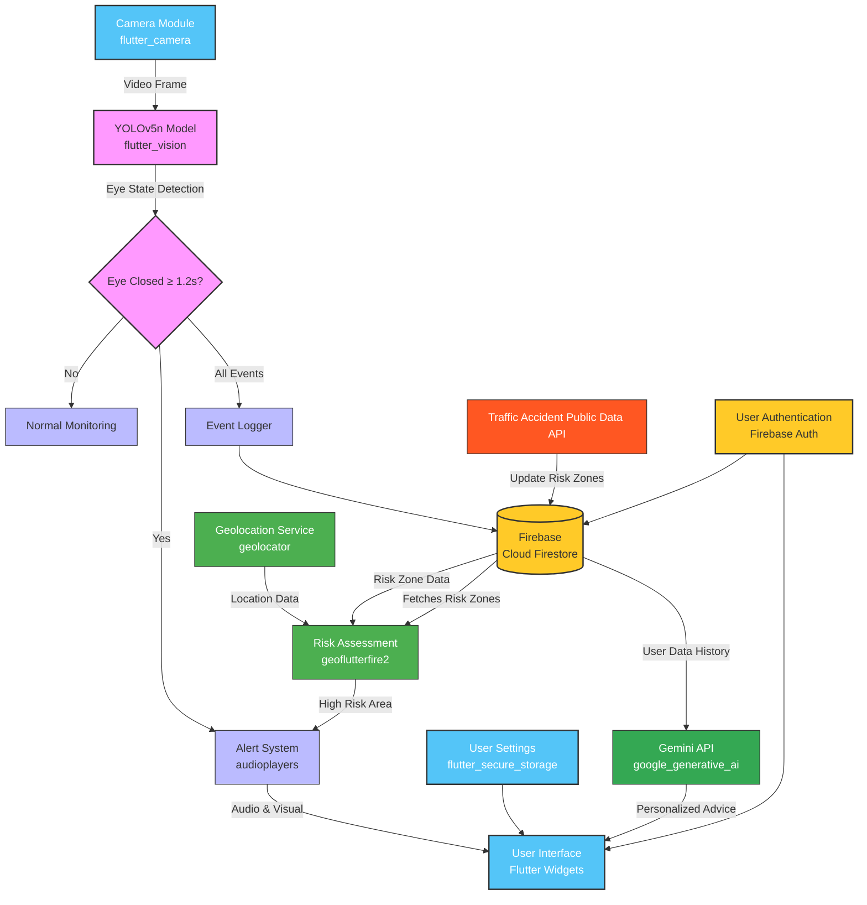

# 💤 WakeUp App – Real-Time Driver Drowsiness Detection

  
  *An eye-closure monitoring mobile application for preventing drowsy driving accidents, built with **Flutter + Firebase** and powered by a lightweight **YOLOv5n** model.*

---
> 🏆 **Award**: 1st Place, NIPA - Google Korea ML Bootcamp (2024, 3rd Cohort) – Selected as top-performing team among all final projects

## 🚨 Motivation

Drowsy driving is the **leading cause of fatal highway accidents in South Korea**,  
with a death rate **nearly twice as high as drunk driving** (2.9 vs. 1.5 per 100 incidents).

Despite its danger, only **17% of surveyed drivers** recognized it as a top-3 risk factor.

> 📊 Sources:  
> - Korea Road Traffic Authority Press Release (2016–2020), Road Safety Division  
> - National Police Agency Traffic Statistics (2019–2023)  
> - Korea Transportation Safety Authority: 2023 Traffic Safety Perception Survey  
> - AAA Foundation (2023): Driver self-assessment simulation

  
  | 🔹 40% of drivers have experienced drowsiness at the wheel |
  |:----------------------------------------------------------:|
  | 🔹 Only 17% of respondents consider it a top-3 risk factor |
  | 🔹 Existing systems are costly, embedded, or lack accessibility |

> **WakeUp** is a lightweight and free mobile solution to detect eye closures, issue warnings, and log drowsy behavior patterns.

---

## 🌟 Features

<table>
  <tr>
    <td width="50%">
      <ul>
        <li>👁️ Real-time detection of eye closure (≥ 1.2s) with <b>flutter_vision</b></li>
        <li>🔔 Audio + visual "WAKE UP" alert system via <b>audioplayers</b></li>
        <li>🧾 Logging of drowsiness events with timestamps to <b>Cloud Firestore</b></li>
      </ul>
    </td>
    <td width="50%">
      <ul>
        <li>📍 Geo-based risk detection using stored accident hotspot data in <b>Cloud Firestore</b></li>
        <li>🧠 <b>(!Not Implemented)Gemini API</b> integration: personalized advice based on user history</li>
        <li>☁️ Full Firebase integration (<b>Auth, Firestore, Cloud Functions</b>)</li>
      </ul>
    </td>
  </tr>
</table>

---

## 🔧 Tech Stack

<table>
  <tr>
    <th align="center">Layer</th>
    <th align="center">Stack</th>
  </tr>
  <tr>
    <td align="center">Framework</td>
    <td align="center"><b>Flutter SDK 3.24.1</b> / Dart SDK 3.5.1</td>
  </tr>
  <tr>
    <td align="center">Frontend</td>
    <td align="center"><b>Flutter Widgets, Camera (0.11.0+2)</b></td>
  </tr>
  <tr>
    <td align="center">Backend</td>
    <td align="center"><b>Firebase (Auth, Cloud Firestore, Cloud Functions)</b></td>
  </tr>
  <tr>
    <td align="center">ML Inference</td>
    <td align="center"><b>YOLOv5n (PyTorch → TFLite), flutter_vision (1.1.4)</b></td>
  </tr>
  <tr>
    <td align="center">Location Services</td>
    <td align="center"><b>geolocator (10.1.1), geoflutterfire2 (2.3.15)</b></td>
  </tr>
  <tr>
    <td align="center">Storage & Security</td>
    <td align="center"><b>Cloud Firestore, flutter_secure_storage (9.2.2)</b></td>
  </tr>
  <tr>
    <td align="center">Additional Features</td>
    <td align="center"><b>audioplayers (6.1.0), google_generative_ai (0.4.6)</b></td>
  </tr>
  <tr>
    <td align="center">DevOps</td>
    <td align="center"><b>GCP</b> (limited due to account expiration)</td>
  </tr>
</table>

---

## 📈 Model Selection Process

Over 140k eye images were filtered, cleaned, and augmented to curate a **~9,200 image dataset**.  
> Initially, the model output confidence hovered around 40% due to noise in the eye images.  
> After comprehensive dataset cleaning and augmentation, our best YOLOv5n model achieved **over 99% detection confidence**,  
> confirming the effectiveness of our pipeline in producing high-quality inference results.

  
<b>📌 Data Preprocessing Details (Click to expand)</b>

   
  
Three key preprocessing phases included:

  <ol>
    <li>Removing:
      <ul>
        <li>ambiguous/half-closed eyes</li>
        <li>low-resolution or glare-heavy images</li>
        <li>duplicates and background interference</li>
      </ul>
    </li>
    <li>Background removal & image cleaning</li>
    <li>Data augmentation: brightness tuning + image flipping</li>
  </ol>
  
<b>Final Dataset Size: 9,200+ images</b>

### 📊 Model Candidates & Results

<table>
  <tr>
    <th align="center">Model</th>
    <th align="center">Precision</th>
    <th align="center">Recall</th>
    <th align="center">mAP@50</th>
    <th align="center">mAP@50–95</th>
  </tr>
  <tr>
    <td align="center"><b>YOLOv5n</b></td>
    <td align="center">0.9676</td>
    <td align="center">0.9619</td>
    <td align="center">0.9631</td>
    <td align="center">0.4822</td>
  </tr>
  <tr>
    <td align="center">YOLOv5s</td>
    <td align="center">0.9710</td>
    <td align="center">0.9651</td>
    <td align="center">0.9632</td>
    <td align="center">0.4978</td>
  </tr>
  <tr>
    <td align="center">YOLOv8n</td>
    <td align="center">0.9672</td>
    <td align="center">0.9461</td>
    <td align="center">0.9629</td>
    <td align="center">0.5126</td>
  </tr>
</table>

> 💡 Despite better accuracy from larger models, **YOLOv5n** was chosen due to its significantly better **latency for mobile environments**.

#### 🔗 WANDB Logs:
- [YOLOv5n Report](https://api.wandb.ai/links/leejaeman/wkmh96a2)  
- [YOLOv8n Report](https://api.wandb.ai/links/leejaeman/mbkep4w5)  
- [YOLOv5s Report](https://api.wandb.ai/links/leejaeman/6c5sg1xq)

---

## 🧠 System Architecture

---

## 📲 App Preview

  <table>
    <tr>
      <td align="center"><b>Home Screen</b></td>
      <td align="center"><b>Alert Triggered</b></td>
    </tr>
    <tr>
      <td align="center">[Home Screen Image]</td>
      <td align="center">[Alert Screen Image]</td>
    </tr>
    <tr>
      <td align="center"><b>Log Window</b></td>
      <td align="center"><b>Toggle Buttons</b></td>
    </tr>
    <tr>
      <td align="center">[Log Screen Image]</td>
      <td align="center">[Button Image]</td>
    </tr>
  </table>

---

## ⚠️ Known Issues & Future Improvements

<table>
  <tr>
    <th width="50%" align="center">Known Issues</th>
    <th width="50%" align="center">Future Improvements</th>
  </tr>
  <tr>
    <td>
      <ul>
        <li>❌ iOS TFLite inference not supported through <b>flutter_vision</b></li>
        <li>❌ Inaccurate detection with front camera (box misalignment)</li>
        <li>❌ Bounding box sometimes remains frozen on Flutter widget tree</li>
        <li>⚠️ Occasional false positives at image edges (needs bounding mask tuning)</li>
      </ul>
    </td>
    <td>
      <ul>
        <li>🚀 Enhance Gemini integration with more sophisticated user pattern analysis</li>
        <li>🚀 Add persistent per-user dashboard with drowsiness history visualization</li>
      </ul>
    </td>
  </tr>
</table>

---

## 📁 Dataset & Contributors

<table>
  <tr>
    <th width="50%" align="center">Dataset & Model Access</th>
    <th width="50%" align="center">Contributors</th>
  </tr>
  <tr>
    <td>
      <ul>
        <li>Preprocessed Dataset (Roboflow): <a href="https://universe.roboflow.com/label-wddb7/rmbg_all">Link</a></li>
        <li>Labeled by hand + cleaned + augmented (9.2k images)</li>
      </ul>
    </td>
    <td>
      <ul>
        <li><b>Jaeman Lee</b> (Team Lead, ML + System Integration, Frontend, Firebase, GCP, Data Preprocessing, Model Training, Geo features)</li>
        <li><b>Juho Son</b> (Data Preprocessing, Model Training, Resource Research)</li>
        <li><b>Bonghyeon Baek</b> (Data Preprocessing, Model evaluation, Resource Research)</li>
      </ul>
    </td>
  </tr>
</table>

---

  
  ## 🔗 Related Resources
  
  | 📘 [Notion Project Page](https://jaeman-hyu.notion.site/?pvs=73) | 🧾 [Presentation PDF]() | 📂 [GitHub Frontend Repo](https://github.com/Jaemani/wakeup_app/) |
  |:---:|:---:|:---:|

