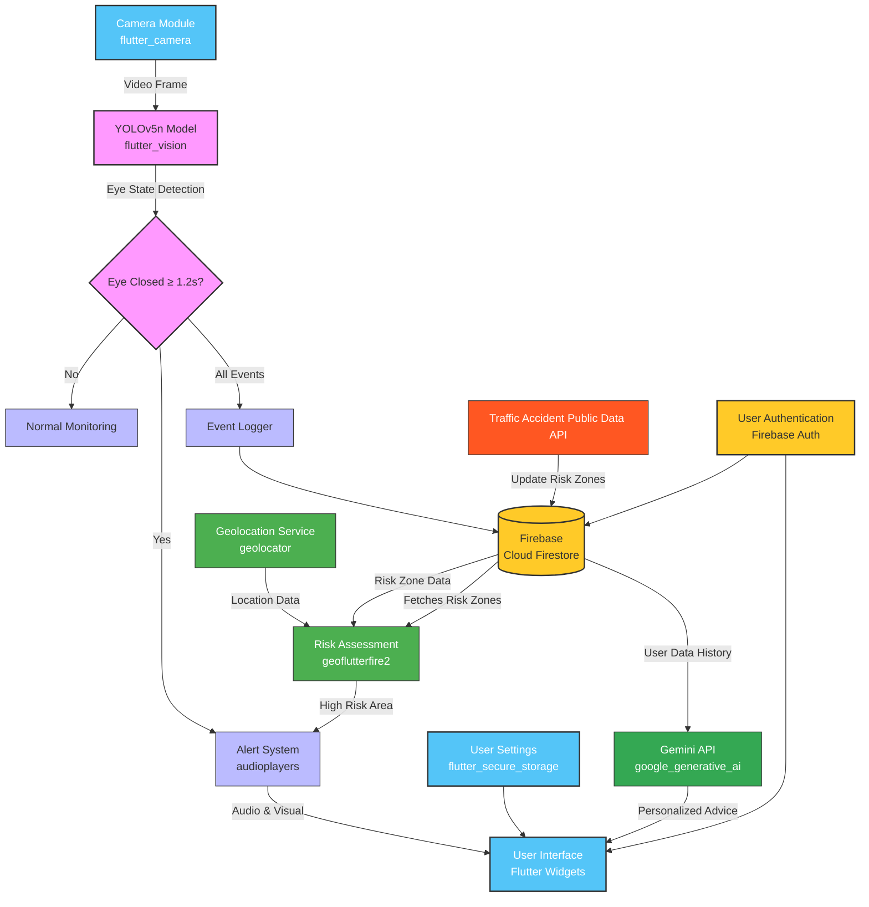

# 💤 WakeUp App – Real-Time Driver Drowsiness Detection


<div align="center">
  
  *An eye-closure monitoring mobile application for preventing drowsy driving accidents, </br>built with **Flutter + Firebase** and powered by a lightweight **YOLOv5n** model.*

</div>

---
> 🏆 **Award**: 1st Place, Google Korea ML Bootcamp (2024, Cohort 3)  
> Selected as the top project among final demo teams, based on technical depth, completeness, and impact  
Hosted by Google Korea and NIPA, the bootcamp focused on building deployable AI systems for real-world applications.


## 🚨 Motivation

Drowsy driving is the **leading cause of fatal highway accidents in South Korea**,  
with a death rate **nearly twice as high as drunk driving** (2.9 vs. 1.5 per 100 incidents).

Despite its danger, only **17% of surveyed drivers** recognized it as a top-3 risk factor.

> 📊 Sources:  
> - Korea Road Traffic Authority Press Release (2016–2020), Road Safety Division  
> - National Police Agency Traffic Statistics (2019–2023)  
> - Korea Transportation Safety Authority: 2023 Traffic Safety Perception Survey  
> - AAA Foundation (2023): Driver self-assessment simulation


<div align="center">
  
  | 🔹 40% of drivers have experienced drowsiness at the wheel |
  |:----------------------------------------------------------:|
  | 🔹 Only 17% of respondents consider it a top-3 risk factor |
  | 🔹 Existing systems are costly, embedded, or lack accessibility |

</div>

> **WakeUp** is a lightweight and free mobile solution to detect eye closures, issue warnings, and log drowsy behavior patterns.

---

## 🌟 Features

<table>
  <tr>
    <td width="50%">
      <ul>
        <li>👁️ Real-time detection of eye closure (≥ 1.2s) with <b>flutter_vision</b></li>
        <li>🔔 Audio + visual "WAKE UP" alert system via <b>audioplayers</b></li>
        <li>🧾 Logging of drowsiness events with timestamps to <b>Cloud Firestore</b></li>
      </ul>
    </td>
    <td width="50%">
      <ul>
        <li>📍 Geo-based risk detection using stored accident hotspot data in <b>Cloud Firestore</b></li>
        <li>🧠 <b>(!Not Implemented)Gemini API</b> integration: personalized advice based on user history</li>
        <li>☁️ Full Firebase integration (<b>Auth, Firestore, Cloud Functions</b>)</li>
      </ul>
    </td>
  </tr>
</table>

---

## 🔧 Tech Stack

<table>
  <tr>
    <th align="center">Layer</th>
    <th align="center">Stack</th>
  </tr>
  <tr>
    <td align="center">Framework</td>
    <td align="center"><b>Flutter SDK 3.24.1</b> / Dart SDK 3.5.1</td>
  </tr>
  <tr>
    <td align="center">Frontend</td>
    <td align="center"><b>Flutter Widgets, Camera (0.11.0+2)</b></td>
  </tr>
  <tr>
    <td align="center">Backend</td>
    <td align="center"><b>Firebase (Auth, Cloud Firestore, Cloud Functions)</b></td>
  </tr>
  <tr>
    <td align="center">ML Inference</td>
    <td align="center"><b>YOLOv5n (PyTorch → TFLite), flutter_vision (1.1.4)</b></td>
  </tr>
  <tr>
    <td align="center">Location Services</td>
    <td align="center"><b>geolocator (10.1.1), geoflutterfire2 (2.3.15)</b></td>
  </tr>
  <tr>
    <td align="center">Storage & Security</td>
    <td align="center"><b>Cloud Firestore, flutter_secure_storage (9.2.2)</b></td>
  </tr>
  <tr>
    <td align="center">Additional Features</td>
    <td align="center"><b>audioplayers (6.1.0), google_generative_ai (0.4.6)</b></td>
  </tr>
  <tr>
    <td align="center">DevOps</td>
    <td align="center"><b>GCP</b> (limited due to account expiration)</td>
  </tr>
</table>

---
## 📈 Model Selection & Evaluation

We initially experimented with EfficientDet-lite and OpenCV-based CNN pipelines but discarded them due to memory overhead and lack of TFLite compatibility on mobile. After several iterations, YOLOv5n proved to be the best balance between speed and accuracy for our real-time use case.

Over 140k eye images were filtered, cleaned, and augmented to curate a **~9,200 image dataset**.  
Initially, the model output confidence hovered around 40% due to noise in the eye images.  
After comprehensive dataset cleaning and augmentation, all final models achieved **over 96%** precision and recall, with F1 scores **exceeding 0.95**, indicating highly reliable detection performance.

---

## 🔁 Dataset Preprocessing Impact

Early training with **raw, unprocessed data** (YOLOv8s v0.1 and v0.2) yielded superficially strong metrics — high confidence scores and clean-looking PR/confusion matrices. However, real-world test accuracy was **unreliable and unstable**, clearly indicating **overfitting** and poor generalization. (All data was found in public and open source)

To address this, we implemented a **three-phase preprocessing pipeline**:

1. **Phase 1**: Removed low-quality or misleading samples  
   - Cropped-eye-only images  
   - Half-open eyes, blurry or low-resolution images  
   - Overexposed or light-reflecting cases
     <details>
        <summary>example</summary>
      
        
      
      </details>

2. **Phase 2**: Filtered for label clarity and spatial consistency  
   - Manually reviewed for background interference, eye occlusion  
   - Removed photos with multiple faces or corrupted labeling
     <details>
        <summary>example</summary>
       
        
      
      </details>

3. **Phase 3**: Augmented for diversity and robustness  
   - Applied brightness adjustment and horizontal flipping  
   - Final dataset curated to ~9,200 clean and balanced samples
     <details>
        <summary>example</summary>
       
        
      
      </details>

| Version      | Precision | Recall | F1 Score | mAP@50 | mAP@50–95 | Notes                          |
|--------------|-----------|--------|----------|--------|-----------|--------------------------------|
| YOLOv8s_v0.1 | ~0.87     | ~0.89  | ~0.88    | ~0.91  | ~0.455    | ❌ Duplicates, unfiltered data |
| YOLOv8s_v0.2 | ~0.90     | ~0.90  | ~0.90    | ~0.80  | ~0.40     | ❌ Poor background filtering   |

After this pipeline was applied, models trained on the new data — **YOLOv8n, YOLOv5s, and YOLOv5n** — showed:
- Consistently **higher real-world reliability**
- **Stable learning curves** with minimal overfitting
- An average **+6.8% mAP@50–95 improvement**
- Better performance **even with smaller architectures**

> ✳️ Key Insight: Preprocessing quality directly influenced real-world robustness. A smaller model with clean data (e.g., YOLOv5n) outperformed a larger model trained on noisy data (e.g., YOLOv8s).

---

## ✅ Final Model Comparison

| Model     | Precision | Recall | F1 Score | mAP@50 | mAP@50–95 |
|-----------|-----------|--------|----------|--------|-----------|
| **YOLOv5n** | 0.9676 | 0.9619 | 0.9647   | 0.9631 | 0.4822    |
| YOLOv5s   | 0.9710    | 0.9651 | 0.9680   | 0.9632 | 0.4978    |
| YOLOv8n   | 0.9672    | 0.9461 | 0.9565   | 0.9629 | 0.5126    |

---

## 🔎 Real-World Test Results

Despite YOLOv8n's excellent validation score, its **real-world test accuracy was ~60%**, indicating overfitting or lack of robustness.  
**YOLOv5n and YOLOv5s consistently delivered >99% accurate predictions** in real-time conditions.

> ✅ **YOLOv5n was selected** due to its compact size, fast inference, and high accuracy — ideal for mobile deployment.

---

## 📊 Metrics Explanation

- **Precision**: Correctness of predicted positive class (eye-closed).
- **Recall**: Coverage of actual positives identified.
- **F1 Score**: Harmonic mean of precision and recall.
- **mAP@50**: Detection accuracy at 0.5 IoU.
- **mAP@50–95**: Stricter range (0.5–0.95 IoU), indicates generalization.

---

## 🖼 Visual Comparisons

### 🔹 Training Loss Curves

| YOLOv5n | YOLOv5s | YOLOv8n | YOLOv8s_v0.1 | YOLOv8s_v0.2 |
|--------|--------|--------|--------|--------|
|  |  |  |  |  |

### 🔹 Precision-Recall Curves

| YOLOv5n | YOLOv5s | YOLOv8n | YOLOv8s_v0.1 | YOLOv8s_v0.2 |
|--------|--------|--------|--------|--------|
|  |  |  |  |  |

### 🔹 Confusion Matrices

| YOLOv5n | YOLOv5s | YOLOv8n | YOLOv8s_v0.1 | YOLOv8s_v0.2 |
|--------|--------|--------|--------|--------|
|  |  |  |  |  |

### 🔹 F1 Score vs Confidence

| YOLOv5n | YOLOv5s | YOLOv8n | YOLOv8s_v0.1 | YOLOv8s_v0.2 |
|--------|--------|--------|--------|--------|
|  |  |  |  |  |

---

## 🔗 WANDB Logs

- [YOLOv8s V0.1 Report](https://api.wandb.ai/links/leejaeman/c2otb110)  
- [YOLOv8s V0.2 Report](https://api.wandb.ai/links/leejaeman/abgsxvjb)
- [YOLOv5n Report](https://api.wandb.ai/links/leejaeman/wkmh96a2)  
- [YOLOv5s Report](https://api.wandb.ai/links/leejaeman/6c5sg1xq)  
- [YOLOv8n Report](https://api.wandb.ai/links/leejaeman/mbkep4w5)  

---

## 🧠 System Architecture

<div align="center">



</div>

---

## 📲 App Preview

<div align="center">
  <table style="width: 100%; table-layout: fixed;">
    <colgroup>
      <col style="width: 50%;" />
      <col style="width: 50%;" />
    </colgroup>
    <tr>
      <td align="center"><b>Home Screen</b></td>
      <td align="center"><b>Screen Components</b></td>
    </tr>
    <tr>
      <td align="center">
        
      </td>
      <td align="center">
        
      </td>
    </tr>
    <tr>
      <td align="center"><b>Log Window</b></td>
      <td align="center"><b>Alert Triggered (after 1.2s of closing)</b></td>
    </tr>
    <tr>
      <td align="center">
        
      </td>
      <td align="center">
        <video src="https://github.com/user-attachments/assets/9dd2e2a6-f2c5-4d27-a81b-4f06ffd63dbc" type="video/mp4" />
      </td>
    </tr>
  </table>
</div>
          
> little bug: ```s``` should be ```ms``` at the report of 'eye closed time' 
---

## ⚠️ Known Issues & Future Improvements

<table>
  <tr>
    <th width="50%" align="center">Known Issues</th>
    <th width="50%" align="center">Future Improvements</th>
  </tr>
  <tr>
    <td>
      <ul>
        <li>❌ iOS TFLite inference not supported through <b>flutter_vision</b></li>
        <li>❌ Inaccurate detection with front camera (box misalignment)</li>
        <li>❌ Bounding box sometimes remains frozen on Flutter widget tree</li>
        <li>⚠️ Occasional false positives at image edges (needs bounding mask tuning)</li>
      </ul>
    </td>
    <td>
      <ul>
        <li>🚀 Enhance Gemini integration with more sophisticated user pattern analysis</li>
        <li>🚀 Add persistent per-user dashboard with drowsiness history visualization</li>
      </ul>
    </td>
  </tr>
</table>

---

## 👤 Contributors

<table>
  <tr>
    <td>
        <b>Jaeman Lee</b> (Team Lead, ML + System Integration, Fullstack, Data Preprocessing, Model Training)</br>
        <b>Juho Son</b> (Data Preprocessing, Model Training, Resource Research)</br>
        <b>Bonghyeon Baek</b> (Data Preprocessing, Model evaluation, Resource Research)
    </td>
  </tr>
</table>

---

<div align="center">
  
  ## 🔗 Related Resources
  
  | 📘 [Notion Project Page](https://jaeman-hyu.notion.site/?pvs=73) | 🧾 [Presentation PDF](https://github.com/user-attachments/files/19998170/Wakeup.Presentation.pdf)| 🤗 [Model Download](https://huggingface.co/Jaemani/eye-closure-detector-yolo-tflite/tree/main) | 📁 [Preprocessed Dataset](https://universe.roboflow.com/label-wddb7/rmbg_all) |
  |:---:|:---:|:---:|:---:|

</div>
